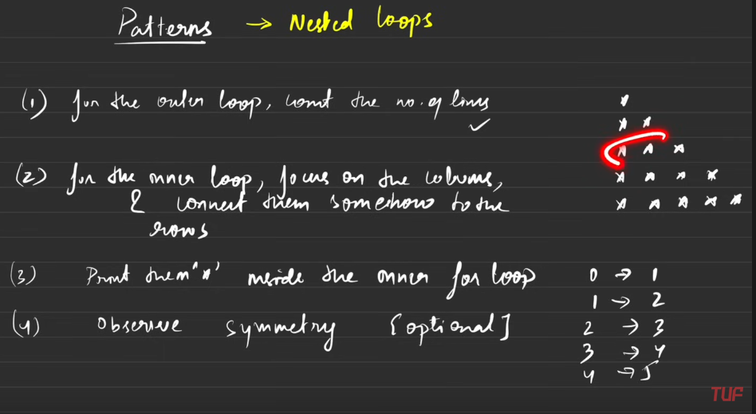
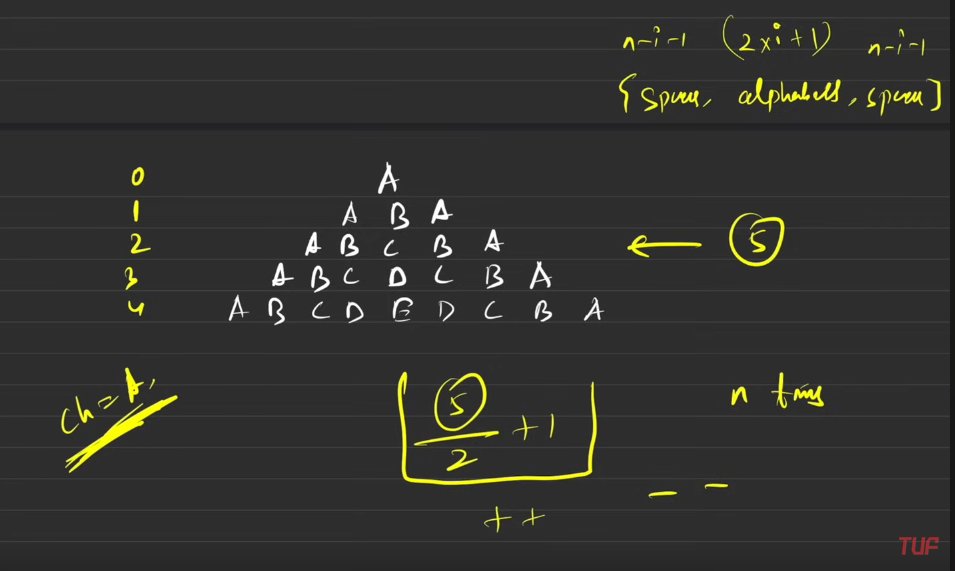
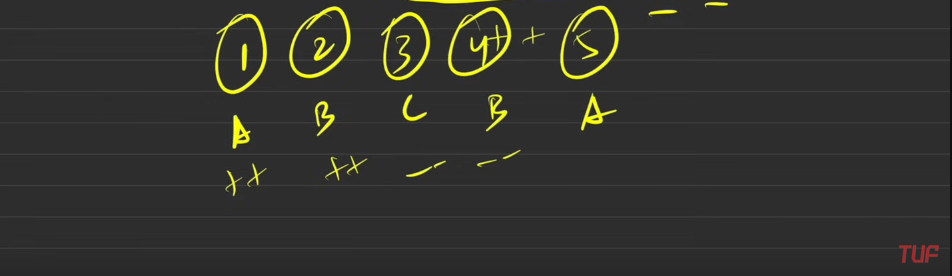
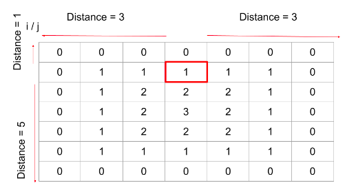
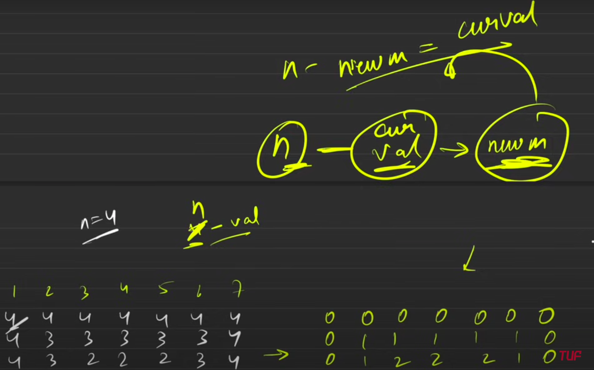
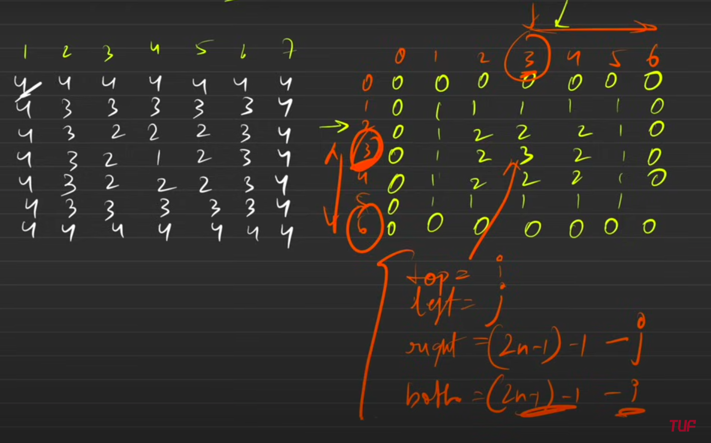

# Patterns
## Table of Contents
- [Patterns](#patterns)
  - [Table of Contents](#table-of-contents)
  - [Tips](#tips)
  - [Pattern - 1: Rectangular Star Pattern](#pattern---1-rectangular-star-pattern)
  - [Pattern - 2: Right-Angled Triangle Pattern](#pattern---2-right-angled-triangle-pattern)
  - [Pattern - 3: Right-Angled Number Pyramid](#pattern---3-right-angled-number-pyramid)
  - [Pattern - 4: Right-Angled Number Pyramid - II](#pattern---4-right-angled-number-pyramid---ii)
  - [Pattern - 5: Inverted Right Pyramid](#pattern---5-inverted-right-pyramid)
  - [\* Pattern - 6: Inverted Numbered Right Pyramid](#-pattern---6-inverted-numbered-right-pyramid)
  - [\* Pattern - 7: Star Pyramid TO BE REView](#-pattern---7-star-pyramid-to-be-review)
  - [Pattern - 8: Inverted Star Pyramid](#pattern---8-inverted-star-pyramid)
  - [Pattern - 9: Diamond Star Pattern](#pattern---9-diamond-star-pattern)
  - [\* Pattern - 10: Half Diamond Star Pattern](#-pattern---10-half-diamond-star-pattern)
  - [\* Pattern - 11: Binary Number Triangle Pattern](#-pattern---11-binary-number-triangle-pattern)
  - [Pattern - 12: Number Crown Pattern](#pattern---12-number-crown-pattern)
  - [Pattern - 13: Increasing Number Triangle Pattern](#pattern---13-increasing-number-triangle-pattern)
  - [\* Pattern - 14: Increasing Letter Triangle Pattern](#-pattern---14-increasing-letter-triangle-pattern)
  - [Pattern - 15: Reverse Letter Triangle Pattern](#pattern---15-reverse-letter-triangle-pattern)
  - [Pattern - 16: Alpha-Ramp Pattern](#pattern---16-alpha-ramp-pattern)
  - [\* Pattern - 17: Alpha-Hill Pattern](#-pattern---17-alpha-hill-pattern)
  - [Pattern - 18: Alpha-Triangle Pattern](#pattern---18-alpha-triangle-pattern)
  - [Pattern - 19: Symmetric-Void Pattern](#pattern---19-symmetric-void-pattern)
  - [Pattern - 20: Symmetric-Butterfly Pattern](#pattern---20-symmetric-butterfly-pattern)
  - [\* Pattern - 21: Hollow Rectangle Pattern](#-pattern---21-hollow-rectangle-pattern)
  - [\* Pattern - 22: The Number Pattern](#-pattern---22-the-number-pattern)
    - [Context](#context)
    - [Detailed Explanation](#detailed-explanation)
      - [Variables](#variables)
      - [Computation](#computation)
      - [Subtracting from `n`](#subtracting-from-n)
    - [Example Walkthrough](#example-walkthrough)
      - [At position `(0, 0)`:](#at-position-0-0)
      - [At position `(1, 1)`:](#at-position-1-1)
      - [At position `(4, 4)` (center):](#at-position-4-4-center)

## Tips
For Online contests and compilers,Don't use int main and just use Functions only ;0 .get used to online compilers.

Just Break stuff, assign line nos ,see both test cases and make patterns ;0

Whenever thinking of 2 different loops for odd even rows into one.
I.e. Try to Merge loops to make code more concise

warna runtime and space matters

combine codes.eg: 4+9 => Q22

also write during logic like this 
```
outer
inner
space
star
space
```

take care of n=critical points like 1,0 etc
```
    if (n==1){cout<<1;}else{//whole code}
```

i did every ques 1st by my own.ie.all ;)
It's a game of How fast you debug ;0

There are 4 general rules for solving a pattern-based question:
1. We always use nested loops for printing the patterns. For the outer loop, we count the number of lines/rows and loop for them.
   Outer Loop for Rows/no. of lines
   Inner Loop for Columns
2. Next, for the inner loop, we focus on the number of columns and somehow connect them to the rows by forming a logic such that for each row we get the required number of columns to be printed.
   row and col. re like 1st row -> 3 cols
   then relation bw row->col
3. We print the ‘*’ inside the inner loop.
4. Observe symmetry in the pattern or check if a pattern is a combination of two or more similar patterns.

In this particular problem, we run the outer loop for N times since we have N rows to be printed, the inner loop.

You can use - instead of spaces for debugging

You are better than 100%
Runtime 14 ms

Use:
```cpp
else if (i1 % 2 != 0) { //avoid extra cases }
```

just pos of 
```
            end--;
            cout<<end<<" ";
```
can reduce extra var usage and major impact on loop

Start by small and play and debug and debug.

[Patterns](#patterns)

## Pattern - 1: Rectangular Star Pattern
```
Example 1:
Input: N = 3
Output: 
* * *
* * *
* * *


Example 2:
Input: N = 6
Output:
* * * * * *
* * * * * *
* * * * * *
* * * * * *
* * * * * *
* * * * * *
```

```cpp
//Pattern-1: Rectangular Star Pattern


// There are 4 general rules for solving a pattern-based question: 

// We always use nested loops for printing the patterns. For the outer loop, we count the number of lines/rows and loop for them.
// Next, for the inner loop, we focus on the number of columns and somehow connect them to the rows by forming a logic such that for each row we get the required number of columns to be printed.
// We print the ‘*’ inside the inner loop.
// Observe symmetry in the pattern or check if a pattern is a combination of two or more similar patterns.
// In this particular problem, we run the outer loop for N times since we have N rows to be printed, the inner loop 


#include<bits/stdc++.h>
using namespace std;

void nForest(int n) {
	// Write your code here.
        // This is the outer loop which will loop for the rows.

	for(int i=0;i<n;i++){
        // This is the inner loop which here, loops for the columns
        // as we have to print a rectangular pattern.
		for(int i1=0;i1<n;i1++){
			std::cout<<"* ";
		}
        // As soon as N stars are printed, we move to the
        // next row and give a line break otherwise all stars
        // would get printed in 1 line.
		std::cout<<"\n";
	}
}


int main() {
        // Here, we have taken the value of n as 5.
    // We can also take input from the user.
    int n;
    cin >> n;
    nForest(n);
}

```
[Patterns](#patterns)

## Pattern - 2: Right-Angled Triangle Pattern

```
Input Format: N = 3
Result: 
* 
* * 
* * *

Input Format: N = 6
Result:
* 
* * 
* * *
* * * *
* * * * *
* * * * * *
```

```cpp
//Pattern-2: Right-Angled Triangle Pattern

#include<bits/stdc++.h>
using namespace std;

void nForest(int n) {
	// Write your code here.
        // This is the outer loop which will loop for the rows.

	for(int i=0;i<n;i++){
        // This is the inner loop which here, loops for the columns
        // as we have to print a rectangular pattern.
		for(int i1=0;i1<=i;i1++){
			std::cout<<"* ";
		}
        // As soon as N stars are printed, we move to the
        // next row and give a line break otherwise all stars
        // would get printed in 1 line.
		std::cout<<"\n";
	}
}


int main() {
        // Here, we have taken the value of n as 5.
    // We can also take input from the user.
    int n;
    cin >> n;
    nForest(n);
}

```
[Patterns](#patterns)

## Pattern - 3: Right-Angled Number Pyramid

```
Input Format: N = 3
Result: 
1
1 2 
1 2 3

Input Format: N = 6
Result:
1
1 2
1 2 3
1 2 3 4
1 2 3 4 5
1 2 3 4 5 6
```

```cpp
// Pattern - 3: Right-Angled Number Pyramid
#include<bits/stdc++.h>
using namespace std;
void nForest(int n) {
    for(int i=1;i<n+1;i++){
		for(int i1=1;i1<=i;i1++){
			std::cout<<i1<<" ";
		}
		std::cout<<"\n";
	}
}
int main() {int n;cin >> n;nForest(n);}
```
[Patterns](#patterns)

## Pattern - 4: Right-Angled Number Pyramid - II
```
Result: 
1
2 2 
3 3 3

Input Format: N = 6
Result:
1
2 2
3 3 3
4 4 4 4
5 5 5 5 5
6 6 6 6 6 6
```

```cpp
// Pattern - 4: Right-Angled Number Pyramid - II
#include<bits/stdc++.h>
using namespace std;
void nForest(int n) {
    for(int i=1;i<n+1;i++){
		for(int i1=1;i1<=i;i1++){
			std::cout<<i<<" ";
		}
		std::cout<<"\n";
	}
}
int main() {int n;cin >> n;nForest(n);}

```
[Patterns](#patterns)

## Pattern - 5: Inverted Right Pyramid
```
Input Format: N = 3
Result: 
* * *
* * 
*

Input Format: N = 6
Result:
* * * * * *
* * * * * 
* * * * 
* * * 
* * 
* 
```

```cpp
#include<bits/stdc++.h>
using namespace std;
void nForest(int n) {
    for(int i=n;i>=1;i--){
		for(int i1=i;i1>=1;i1--){
			std::cout<<"* ";
		}
		std::cout<<"\n";
	}
}
int main() {int n;cin >> n;nForest(n);}

```
[Patterns](#patterns)

## * Pattern - 6: Inverted Numbered Right Pyramid
```
Input Format: N = 3
Result: 
1 2 3
1 2
1

Input Format: N = 6
Result:
1 2 3 4 5 6
1 2 3 4 5
1 2 3 4
1 2 3
1 2 
1
```

```cpp
// Pattern - 6: Inverted Numbered Right Pyramid
#include<bits/stdc++.h>
using namespace std;
void nForest(int n) {
    for(int i=n;i>=1;i--){
		for(int i1=1;i1<=i;i1++){
			std::cout<<i1<<" ";
		}
		std::cout<<"\n";
	}
}
int main() {int n;cin >> n;nForest(n);}

```
```cpp
#include <bits/stdc++.h>
using namespace std;

void pattern6(int N)
{
    // This is the outer loop which will loop for the rows.
    for (int i = 0; i < N; i++)
    {
         // This is the inner loop which loops for the columns
        // no. of columns = (N - row index) for each line here
        // as we have to print an inverted pyramid.
        // (N-j) will give us the numbers in a row starting from 1 to N-i.
        for (int j =N; j>i; j--)
        {
            cout <<N-j+1<<" ";
        }
       
        // As soon as numbers for each iteration are printed, we move to the
        // next row and give a line break otherwise all numbers
        // would get printed in 1 line.
        cout << endl;
    }
}

int main()
{   
    // Here, we have taken the value of N as 5.
    // We can also take input from the user.
    int N = 5;

    pattern6(N);

    return 0;
}

```
[Patterns](#patterns)

## * Pattern - 7: Star Pyramid TO BE REView
```
Input Format: N = 3
Result: 
  *  
 *** 
*****   
Input Format: N = 6
Result:
     *     
    ***    
   *****   
  *******  
 ********* 
***********
```

```cpp
#include<bits/stdc++.h>
using namespace std;
void nForest(int n) {

    for (int i = 0; i <= n-1; i++) {

        for (int i1=n-1; i1>i;i1--){cout<<" ";}
        for (int i1=0;i1<i;i1++){cout<<"*";}
        //left half

        
        cout<<"*";
        //middle * only

        for (int i1=0;i1<i;i1++){cout<<"*";}
        for (int i1=n-1; i1>i;i1--){cout<<" ";}
        //right half

        cout<<endl;
        //newline
    }

}
int main() {int n;cin >> n;nForest(n);}
```

```cpp
#include <bits/stdc++.h>
using namespace std;

void pattern7(int N)
{
    // This is the outer loop which will loop for the rows.
    for (int i = 0; i < N; i++)
    {
        // For printing the spaces before stars in each row
        for (int j =0; j<N-i-1; j++)
        {
            cout <<" ";
        }
       
        // For printing the stars in each row
        for(int j=0;j< 2*i+1;j++){
            
            cout<<"*";
        }
        
        // For printing the spaces after the stars in each row
         for (int j =0; j<N-i-1; j++)
        {
            cout <<" ";
        }
        
        // As soon as the stars for each iteration are printed, we move to the
        // next row and give a line break otherwise all stars
        // would get printed in 1 line.
        cout << endl;
    }
}

int main()
{   
    // Here, we have taken the value of N as 5.
    // We can also take input from the user.
    int N = 5;

    pattern7(N);

    return 0;
}

```
[Patterns](#patterns)

## Pattern - 8: Inverted Star Pyramid
```
Input Format: N = 3
Result: 
*****  
 ***
  *   
Input Format: N = 6
Result:     
***********
 *********
  *******
   ***** 
    ***    
     *
```

```cpp

#include<bits/stdc++.h>
using namespace std;
void nForest(int n) {

    for (int i = 0; i <= n-1; i++) {
        for (int i1=0;i1<i;i1++){cout<<" ";}

        for (int i1=n-1; i1>i;i1--){cout<<"*";}
        //left half

        
        cout<<"*";
        //middle * only
        for (int i1=n-1; i1>i;i1--){cout<<"*";}
        for (int i1=0;i1<i;i1++){cout<<" ";}

        //right half

        cout<<endl;
        //newline
    }

}
int main() {int n;cin >> n;nForest(n);}
```

```cpp
#include <bits/stdc++.h>
using namespace std;

void pattern8(int N)
{
    // This is the outer loop which will loop for the rows.
    for (int i = 0; i < N; i++)
    {
        // For printing the spaces before stars in each row
        for (int j =0; j<i; j++)
        {
            cout <<" ";
        }
       
        // For printing the stars in each row
        for(int j=0;j< 2*N -(2*i +1);j++){
            
            cout<<"*";
        }
        
        // For printing the spaces after the stars in each row
         for (int j =0; j<i; j++)
        {
            cout <<" ";
        }
        
        // As soon as the stars for each iteration are printed, we move to the
        // next row and give a line break otherwise all stars
        // would get printed in 1 line.
        cout << endl;
    }
}

int main()
{   
    // Here, we have taken the value of N as 5.
    // We can also take input from the user.
    int N = 5;

    pattern8(N);

    return 0;
}

```

[Patterns](#patterns)

## Pattern - 9: Diamond Star Pattern
```
Input Format: N = 3
Result: 
  *  
 ***
***** 
*****  
 ***
  *   
Input Format: N = 6
Result:   
     *
    ***
   ***** 
  *******
 *********
***********  
***********
 *********
  *******
   ***** 
    ***    
     *
```

```cpp

#include<bits/stdc++.h>
using namespace std;
void nForest(int n) {
    for (int i = 0; i <= n-1; i++) {

        for (int i1=n-1; i1>i;i1--){cout<<" ";}
        for (int i1=0;i1<i;i1++){cout<<"*";}
        //left half

        
        cout<<"*";
        //middle * only

        for (int i1=0;i1<i;i1++){cout<<"*";}
        for (int i1=n-1; i1>i;i1--){cout<<" ";}
        //right half

        cout<<endl;
        //newline
    }

    for (int i = 0; i <= n-1; i++) {
        for (int i1=0;i1<i;i1++){cout<<" ";}

        for (int i1=n-1; i1>i;i1--){cout<<"*";}
        //left half

        
        cout<<"*";
        //middle * only
        for (int i1=n-1; i1>i;i1--){cout<<"*";}
        for (int i1=0;i1<i;i1++){cout<<" ";}

        //right half

        cout<<endl;
        //newline
    }

}


int main() {int n;cin >> n;nForest(n);}
```
```cpp
#include <bits/stdc++.h>
using namespace std;

void erect_pyramid(int N)
{
    // This is the outer loop which will loop for the rows.
    for (int i = 0; i < N; i++)
    {
        // For printing the spaces before stars in each row
        for (int j =0; j<N-i-1; j++)
        {
            cout <<" ";
        }
       
        // For printing the stars in each row
        for(int j=0;j< 2*i+1;j++){
            
            cout<<"*";
        }
        
        // For printing the spaces after the stars in each row
         for (int j =0; j<N-i-1; j++)
        {
            cout <<" ";
        }
        
        // As soon as the stars for each iteration are printed, we move to the
        // next row and give a line break otherwise all stars
        // would get printed in 1 line.
        cout << endl;
    }
}

void inverted_pyramid(int N)
{
    // This is the outer loop which will loop for the rows.
    for (int i = 0; i < N; i++)
    {
        // For printing the spaces before stars in each row
        for (int j =0; j<i; j++)
        {
            cout <<" ";
        }
       
        // For printing the stars in each row
        for(int j=0;j< 2*N -(2*i +1);j++){
            
            cout<<"*";
        }
        
        // For printing the spaces after the stars in each row
         for (int j =0; j<i; j++)
        {
            cout <<" ";
        }
        
        // As soon as the stars for each iteration are printed, we move to the
        // next row and give a line break otherwise all stars
        // would get printed in 1 line.
        cout << endl;
    }
}

int main()
{   
    // Here, we have taken the value of N as 5.
    // We can also take input from the user.
    int N = 5;
    erect_pyramid(N);
    inverted_pyramid(N);

    return 0;
}

```


[Patterns](#patterns)

## * Pattern - 10: Half Diamond Star Pattern 
```
Input Format: N = 3
Result: 
*  
**
***  
**
*   
Input Format: N = 6
Result:   
*
**
*** 
****
*****
******  
*****
****
***    
**
*
```

```cpp

#include<bits/stdc++.h>
using namespace std;
void nForest(int n) {
    for (int i = 0; i <= n-2; i++) {

        // for (int i1=n-1; i1>i;i1--){cout<<" ";}
        // for (int i1=0;i1<i;i1++){cout<<"*";}
        //left half

        
        cout<<"*";
        //middle * only

        for (int i1=0;i1<i;i1++){cout<<"*";}
        for (int i1=n-1; i1>i;i1--){cout<<" ";}
        //right half

        cout<<endl;
        //newline
    }

    //with biggest line ;)
    for (int i = 0; i <= n-1; i++) {
        // for (int i1=0;i1<i;i1++){cout<<" ";}
        // for (int i1=n-1; i1>i;i1--){cout<<"*";}
        //left half

        
        cout<<"*";
        //middle * only
        for (int i1=n-1; i1>i;i1--){cout<<"*";}
        for (int i1=0;i1<i;i1++){cout<<" ";}

        //right half

        cout<<endl;
        //newline
    }

}


int main() {int n;cin >> n;nForest(n);}
```
```cpp
#include <bits/stdc++.h>
using namespace std;

void pattern10(int N)
{
      // Outer loop for number of rows.
      for(int i=1;i<=2*N-1;i++){
          
          // stars would be equal to the row no. uptill first half 
          int stars = i;
          
          // for the second half of the rotated triangle.
          if(i>N) stars = 2*N-i;
          
          // for printing the stars in each row.
          for(int j=1;j<=stars;j++){
              cout<<"*";
          }
          
           // As soon as the stars for each iteration are printed, we move to the
          // next row and give a line break otherwise all stars
          // would get printed in 1 line.
          cout<<endl;
      }
}

int main()
{   
    // Here, we have taken the value of N as 5.
    // We can also take input from the user.
    int N = 5;
    pattern10(N);

    return 0;
}

```
[Patterns](#patterns)

## * Pattern - 11: Binary Number Triangle Pattern
start = 1-start

You are better than
100%
Runtime
14 ms

use
: else if (i1 % 2 != 0) {//avoid extra cases

start by small and play and debug and debug

```
Input Format: N = 3
Result: 
1
01
101

Input Format: N = 6
Result:   
1
01
101
0101
10101
010101
```

```cpp
#include <bits/stdc++.h>
using namespace std;

void nForest(int n) {
    for (int i = 1; i <= n; i++) {
        if (i % 2 == 0) { // i=2
            for (int i1 = 1; i1 <= i; i1++) { //i1=1,2
                if (i1 % 2 == 0) {
                        cout << "1 ";
                    
                } else if (i1 % 2 != 0) {//avoid extra
                    cout << "0 ";
                }
            }
        } else if (i % 2 != 0) {
            for (int i1 = 1; i1 <= i; i1++) {
                if (i1 % 2 == 0) {
                        cout << "0 ";
                } else if (i1 % 2 != 0){
                    cout << "1 ";
                }
            }
        }
        cout << endl;
    }
}

int main() {
    int n;
    cin >> n;
    nForest(n);
    return 0;
}

```
```cpp
#include<bits/stdc++.h>

using namespace std;

int main(){
    int t;
    cin >> t;
    for(int i=0;i<t;i++){
        for(int j=0;j<=i;j++){
            if(i%2==0) cout << (j%2+1)%2;
            else cout << j%2;
        }
        cout << "\n";
    }
    return 0;
}
```
```cpp
#include <bits/stdc++.h>
using namespace std;

void pattern11(int N)
{
      // First row starts by printing a single 1.
      int start =1;
      
      // Outer loop for the no. of rows
      for(int i=0;i<N;i++){
          
          // if the row index is even then 1 is printed first
          // in that row.
          if(i%2 ==0) start = 1;
          
          // if odd, then the first 0 will be printed in that row.
          else start = 0;
          
          // We alternatively print 1's and 0's in each row by using
          // the inner for loop.
          for(int j=0;j<=i;j++){
              cout<<start;
              start = 1-start;
          }
      
      
        // As soon as the numbers for each iteration are printed, we move to the
        // next row and give a line break otherwise all numbers
        // would get printed in 1 line.
        cout<<endl;
      }
}

int main()
{   
    // Here, we have taken the value of N as 5.
    // We can also take input from the user.
    int N = 5;
    pattern11(N);

    return 0;
}

```
[Patterns](#patterns)

## Pattern - 12: Number Crown Pattern
```
Input Format: N = 3
Result: 
1    1
12  21
123321

Input Format: N = 6
Result:   
1          1
12        21
123      321
1234    4321
12345  54321
123456654321
```

```cpp
#include <bits/stdc++.h>
using namespace std;

void nForest(int n) {
    for (int i = 1; i <= n; i++) {
        //loop1
        for(int i1=1;i1<=i;i1++){cout<<i1;}
        //(n-i)*2
        int sp=((n-i)*2);
        for(int i1=1;i1<=sp;i1++){cout<<" ";}
        //loop2rev
        for(int i1=i;i1>0;i1--){cout<<i1;}
        cout<<"\n";
    }
}

int main() {
    int n;
    cin >> n;
    nForest(n);
    return 0;
}


//code-runner.runInTerminal
```
```cpp
#include <bits/stdc++.h>
using namespace std;

void pattern12(int N)
{
      // initial no. of spaces in row 1.
      int spaces = 2*(N-1);
      
      // Outer loop for the number of rows.
      for(int i=1;i<=N;i++){
          
          // for printing numbers in each row
          for(int j=1;j<=i;j++){
              cout<<j;
          }
          
          // for printing spaces in each row
          for(int j = 1;j<=spaces;j++){
              cout<<" ";
          }
          
          // for printing numbers in each row
          for(int j=i;j>=1;j--){
              cout<<j;
          }
          
          // As soon as the numbers for each iteration are printed, we move to the
          // next row and give a line break otherwise all numbers
          // would get printed in 1 line.
          cout<<endl;
          
          // After each iteration nos. increase by 2, thus
          // spaces will decrement by 2.
          spaces-=2;
      }
}

int main()
{   
    // Here, we have taken the value of N as 5.
    // We can also take input from the user.
    int N = 5;
    pattern12(N);

    return 0;
}

```
[Patterns](#patterns)

## Pattern - 13: Increasing Number Triangle Pattern

```
Input Format: N = 3
Result: 
1
2 3
4 5 6

Input Format: N = 6
Result:   
1
2  3
4  5  6
7  8  9  10
11  12  13  14  15
16  17  18  19  20  21
```

```cpp
#include <bits/stdc++.h>
using namespace std;

void nForest(int n) {
    int s1 =1;
    for (int i = 1; i <= n; i++) {
        
        for (int i1 = 1; i1 <= i; i1++)
        {
            /* code */
            cout<<s1<<" ";
            s1++;
        }
        

        cout<<"\n";
    }
}

int main() {
    int n;
    cin >> n;
    nForest(n);
    return 0;
}


//code-runner.runInTerminal
```
[Patterns](#patterns)

## * Pattern - 14: Increasing Letter Triangle Pattern

```
Input Format: N = 3
Result: 
A
A B
A B C

Input Format: N = 6
Result:   
A
A B
A B C
A B C D
A B C D E
A B C D E F
```

```cpp
#include <bits/stdc++.h>
using namespace std;

void nForest(int n) {
    for (int i =0; i < n; i++)
    {
        /* code */
        for (char i1 = 'A'; i1 <= 'A'+i; i1++)
        {
            /* code */
            cout<<i1<<" ";
        }
        cout<<"\n";
        
    }
    
}

int main() {
    int n;
    cin >> n;
    nForest(n);
    return 0;
}


//code-runner.runInTerminal
```

ASCII Char Typecast
```cpp
#include <bits/stdc++.h>

using namespace std;

int main(){
    int t;
    cin >> t;
    for(int i=1;i<=t;i++){
        for(int j=1;j<=i;j++){
            cout << char(64+j) << " ";
        }
        cout << "\n";
    }
    return 0;
}
```

[Patterns](#patterns)

## Pattern - 15: Reverse Letter Triangle Pattern
```
Input Format: N = 3
Result: 
A B C
A B
A

Input Format: N = 6
Result:   
A B C D E F
A B C D E 
A B C D
A B C
A B
A
```

```cpp
#include <bits/stdc++.h>
using namespace std;

void nForest(int n) {
    for (int i =n; i >= 1; i--)
    {
        /* code */
        for (char i1 = 'A'; i1 <= 'A'+i-1; i1++)
        {
            /* code */
            cout<<i1<<" ";
        }
        cout<<"\n";
        
    }
    
}

int main() {
    int n;
    cin >> n;
    nForest(n);
    return 0;
}


//code-runner.runInTerminal
```
```cpp
#include <bits/stdc++.h>
using namespace std;

void pattern15(int N)
{
    
      // Outer loop for the number of rows.
      for(int i=0;i<N;i++){
          
          // Inner loop will loop for i times and
          // print alphabets from A to A + (N-i-1).
          for(char ch = 'A'; ch<='A'+(N-i-1);ch++){
              cout<<ch<<" ";
              
          }
          // As soon as the letters for each iteration are printed, we move to the
          // next row and give a line break otherwise all letters
          // would get printed in 1 line.
          cout<<endl;
          
      }
}

int main()
{   
    // Here, we have taken the value of N as 5.
    // We can also take input from the user.
    int N = 5;
    pattern15(N);

    return 0;
}

```
[Patterns](#patterns)

## Pattern - 16: Alpha-Ramp Pattern
```
Input Format: N = 3
Result: 
A
B B
C C C

Input Format: N = 6
Result:   
A 
B B
C C C
D D D D
E E E E E
F F F F F F
```

```cpp
#include <bits/stdc++.h>
using namespace std;

void nForest(int n) {
    char i1 = 'A';
    for (int i =0; i < n; i++)
    {
        /* code */
        
        for (int i2=1;i2<=i+1;i2++)
        {
            /* code */
            cout<<i1<<" ";
        }
        i1+=1;
        cout<<"\n";
        
        
    }
    
}

int main() {
    int n;
    cin >> n;
    nForest(n);
    return 0;
}


```
```cpp
#include <bits/stdc++.h>
using namespace std;

void pattern16(int N)
{
    
      // Outer loop for the number of rows.
      for(int i=0;i<N;i++){
          
          // Defining character for each row.
          char ch = 'A'+i;
          for(int j=0;j<=i;j++){
              
              // same char is to be printed i times in that row.
              cout<<ch<<" ";
              
          }
          // As soon as the letters for each iteration are printed, we move to the
          // next row and give a line break otherwise all letters
          // would get printed in 1 line.
          cout<<endl;
          
      }
}

int main()
{   
    // Here, we have taken the value of N as 5.
    // We can also take input from the user.
    int N = 5;
    pattern16(N);

    return 0;
}

```
[Patterns](#patterns)

## * Pattern - 17: Alpha-Hill Pattern 
```
Input Format: N = 3
Result: 
  A  
 ABA 
ABCBA


Input Format: N = 6
Result:   
     A     
    ABA    
   ABCBA   
  ABCDCBA  
 ABCDEDCBA 
ABCDEFEDCBA
```

```cpp
#include <bits/stdc++.h>
using namespace std;

void nForest(int n) {
    for (int i =1; i <= n; i++)
    {   
        for (int i1 = n-i; i1 > 0; i1--)
        {
            /* code */
            cout<<" "<<" ";
        }

        char s = 'A';
        for (char i1 = 'A'; i1 < 'A'+i ; i1++)
        {
            /* code */
            cout<<s<<" ";
            s++;
        }
        s--;
        for (char i1 = 'A'+i-1; i1 > 'A' ; i1--)
        {
            /* code */
            s--;
            cout<<s<<" ";
            
        }
        
        

        cout<<"\n";   
    }
}

int main() {
    int n;
    cin >> n;
    nForest(n);
    return 0;
}


//code-runner.runInTerminal
```


pattern 7 approach
```cpp
#include <bits/stdc++.h>
using namespace std;

void pattern17(int N)
{
    
      // Outer loop for the number of rows.
      for(int i=0;i<N;i++){
          
          // for printing the spaces.
          for(int j=0;j<N-i-1;j++){
              cout<<" ";
          }
          
          // for printing the characters.
          char ch = 'A';
          int breakpoint = (2*i+1)/2;
          for(int j=1;j<=2*i+1;j++){
              
              cout<<ch;
              if(j <= breakpoint) ch++;
              else ch--;
          }
          
          // for printing the spaces again after characters.
          for(int j=0;j<N-i-1;j++){
              cout<<" ";
          }
          
          // As soon as the letters for each iteration are printed, we move to the
          // next row and give a line break otherwise all letters
          // would get printed in 1 line.
          cout<<endl;
          
      }
}

int main()
{   
    // Here, we have taken the value of N as 5.
    // We can also take input from the user.
    int N = 5;
    
    pattern17(N);

    return 0;
}

```
[Patterns](#patterns)

## Pattern - 18: Alpha-Triangle Pattern
just pos of 
```
            end--;
            cout<<end<<" ";
```
can reduce extra var usage and major impact on loop


```
Input Format: N = 3
Result: 
C
B C
A B C

Input Format: N = 6
Result:   
F
E F
D E F
C D E F
B C D E F
A B C D E F
```

```cpp
#include <bits/stdc++.h>
using namespace std;

void nForest(int n) {
    for (int i =1; i <= n; i++)
    {
        char end = 'A'+n;
        
        for (char start=end-i;start<end;start++)
        {   
            /* code */
            cout<<start<<" ";
        }
        
        cout<<"\n";
        
    }
    
}

int main() {
    int n;
    cin >> n;
    nForest(n);
    return 0;
}
```

```
Sample Input 1:
3
Sample Output 1:
C
C B 
C B A
Sample Input 2 :
1
Sample Output 2 :
A
```

```cpp

#include <bits/stdc++.h>
using namespace std;

void nForest(int n) {
    for (int i =1; i <= n; i++)
    {
        char end = 'A'+n;
        for (int i1 = 1; i1 <= i; i1++)
        {
            /* code */
            end--;
            cout<<end<<" ";
            
        }
        
        
        cout<<"\n";
        
    }
    
}

int main() {
    int n;
    cin >> n;
    nForest(n);
    return 0;
}
```
```cpp
#include <bits/stdc++.h>
using namespace std;

void pattern18(int N)
{
      // Outer loop for the no. of rows.
      for(int i=0;i<N;i++){
          
          // Inner loop for printing the alphabets from
          // A + N -1 -i (i is row no.) to A + N -1 ( E in this case).
          for(char ch =('A'+N-1)-i;ch<=('A'+N-1);ch++){
              
              cout<<ch<<" ";
          }
          
          // As soon as the letters for each iteration are printed, we move to the
          // next row and give a line break otherwise all letters
          // would get printed in 1 line.
          cout<<endl;
      }
}

int main()
{   
    // Here, we have taken the value of N as 5.
    // We can also take input from the user.
    int N = 5;
    
    pattern18(N);

    return 0;
}

```
[Patterns](#patterns)

## Pattern - 19: Symmetric-Void Pattern
It's a game of How fast you debug ;0
```
Input Format: N = 3
Result: 
******
**  **
*    *
*    *
**  **
******

Input Format: N = 6
Result:   
************
*****  *****
****    ****
***      ***
**        **
*          *
*          *
**        **
***      ***
****    ****
*****  *****
************
```

```cpp

#include <bits/stdc++.h>
using namespace std;

void nForest(int n) {
    for (int i =n; i >0; i--)
    {
        for (int i1 = i; i1 > 0; i1--)
        {
            /* code */
            cout<<"*"<<" ";
        }
        for (int i1 = (n-i)*2 ; i1 >0; i1--)
        {
            /* code */
            cout<<"  ";
        }


        for (int i1 = i; i1 > 0; i1--)
        {
            /* code */
            cout<<"*"<<" ";
        }
        cout<<"\n";
        
    }
    for (int i =1; i <= n; i++)
    {
        for (int i1 = 0; i1 < i; i1++)
        {
            /* code */
            cout<<"*"<<" ";
        }
        for (int i1 = (n-i)*2 ; i1 >0; i1--)
        {
            /* code */
            cout<<"  ";
        }


        for (int i1 = 0; i1 < i; i1++)
        {
            /* code */
            cout<<"*"<<" ";
        }
        cout<<"\n";
        
    }
    
}

int main() {
    int n;
    cin >> n;
    nForest(n);
    return 0;
}
```
```cpp
#include <bits/stdc++.h>
using namespace std;

void pattern19(int N)
{
      // for the upper half of the pattern.
      
      // initial spaces.
      int iniS = 0;
      for(int i=0;i< N;i++){
          
          //for printing the stars in the row.
          for(int j=1;j<=N-i;j++){
              cout<<"*";
          }
          
          //for printing the spaces in the row.
          for(int j=0;j<iniS;j++){
              cout<<" ";
          }
          
          //for printing the stars in the row.
          for(int j=1;j<=N-i;j++){
              cout<<"*";
          }
          
          // The spaces increase by 2 every time we hit a new row.
          iniS+=2;
          
          // As soon as the stars for each iteration are printed, we move to the
          // next row and give a line break otherwise all stars
          // would get printed in 1 line.
          cout<<endl;
      }
      
      // for lower half of the pattern
      
      // initial spaces.
      iniS = 2*N -2;
      for(int i=1;i<=N;i++){
          
          //for printing the stars in the row.
          for(int j=1;j<=i;j++){
              cout<<"*";
          }
          
          //for printing the spaces in the row.
          for(int j=0;j<iniS;j++){
              cout<<" ";
          }
          
          //for printing the stars in the row.
          for(int j=1;j<=i;j++){
              cout<<"*";
          }
          
          // The spaces decrease by 2 every time we hit a new row.
          iniS-=2;
          
          // As soon as the stars for each iteration are printed, we move to the
          // next row and give a line break otherwise all stars
          // would get printed in 1 line.
          cout<<endl;
      }
      
}

int main()
{   
    // Here, we have taken the value of N as 5.
    // We can also take input from the user.
    int N = 5;
    
    pattern19(N);

    return 0;
}

```
[Patterns](#patterns)

## Pattern - 20: Symmetric-Butterfly Pattern
```
Input Format: N = 3
Result: 
*    *
**  **
******
**  **
*    *


Input Format: N = 6
Result:   
*          *
**        **
***      ***
****    ****
*****  *****
************
*****  *****
****    ****
***      ***
**        **
*          *
```

```cpp

#include <bits/stdc++.h>
using namespace std;

void nForest(int n) {
        for (int i =1; i <= n; i++)
    {
        for (int i1 = 0; i1 < i; i1++)
        {
            /* code */
            cout<<"*"<<" ";
        }
        for (int i1 = (n-i)*2 ; i1 >0; i1--)
        {
            /* code */
            cout<<"  ";
        }


        for (int i1 = 0; i1 < i; i1++)
        {
            /* code */
            cout<<"*"<<" ";
        }
        cout<<"\n";
        
    }
        for (int i =n-1; i >0; i--)
    {
        for (int i1 = i; i1 > 0; i1--)
        {
            /* code */
            cout<<"*"<<" ";
        }
        for (int i1 = (n-i)*2 ; i1 >0; i1--)
        {
            /* code */
            cout<<"  ";
        }


        for (int i1 = i; i1 > 0; i1--)
        {
            /* code */
            cout<<"*"<<" ";
        }
        cout<<"\n";
        
    }

    
}

int main() {
    int n;
    cin >> n;
    nForest(n);
    return 0;
}
```
```cpp
#include <bits/stdc++.h>
using namespace std;

void pattern20(int n)
{
      // initialising the spaces.
      int spaces = 2*n-2;
      
      // Outer loop for printing row.
      for(int i = 1;i<=2*n-1;i++){
          
          // stars for first half
          int stars = i;
          
          // stars for the second half.
          if(i>n) stars = 2*n - i;
          
          //for printing the stars
          for(int j=1;j<=stars;j++){
              cout<<"*";
          }
          
          //for printing the spaces
          for(int j = 1;j<=spaces;j++){
              cout<<" ";
          }
          
          //for printing the stars
          for(int j = 1;j<=stars;j++){
              cout<<"*";
          }
          
          // As soon as the stars for each iteration are printed, we move to the
          // next row and give a line break otherwise all stars
          // would get printed in 1 line.
          cout<<endl;
          if(i<n) spaces -=2;
          else spaces +=2;
      }
      
}

int main()
{   
    // Here, we have taken the value of N as 5.
    // We can also take input from the user.
    int N = 5;
    
    pattern20(N);

    return 0;
}

```

[Patterns](#patterns)

## * Pattern - 21: Hollow Rectangle Pattern
```
Input Format: N = 3
Result: 
***
* *
***

Input Format: N = 6
Result:   
******
*    *
*    *
*    *
*    *
******
```

```cpp

#include <bits/stdc++.h>
using namespace std;

void nForest(int n) {
    if (n==1){cout<<"*";}else{
    for (int i1=1; i1 <= n; i1++)
        {
            cout<<"*";
        }
        cout<<"\n";
        for (int i =1; i <= n-2; i++)
    {   cout<<"*"; 
        for (int i1=1;i1<=n-2;i1++){cout<<" ";}
        cout<<"*";
        cout<<"\n";
    }
    for (int i1=1; i1 <= n; i1++)
        {
            cout<<"*";
        }}

    
}

int main() {
    int n;
    cin >> n;
    nForest(n);
    return 0;
}
```

             if(i==0 || j==0 || i==n-1 || j==n-1)
                cout<<"*";
                
             // if not border index, print space.
             else cout<<" ";

```cpp
#include <bits/stdc++.h>
using namespace std;

void pattern21(int n)
{
     // outer loop for no. of rows.
     for(int i=0;i<n;i++){
         
         // inner loop for printing the stars at borders only.
         for(int j=0;j<n;j++){
             
             if(i==0 || j==0 || i==n-1 || j==n-1)
                cout<<"*";
                
             // if not border index, print space.
             else cout<<" ";
         }
         
          // As soon as the stars for each iteration are printed, we move to the
          // next row and give a line break otherwise all stars
          // would get printed in 1 line.
          cout<<endl;
     }
      
}

int main()
{   
    // Here, we have taken the value of N as 5.
    // We can also take input from the user.
    int N = 5;
    
    pattern21(N);

    return 0;
}

```

[Patterns](#patterns)

## * Pattern - 22: The Number Pattern 
combine codes.eg: 4+9 => Q22

Just Break stuff, assign line nos ,see both test cases and make patterns ;0

take care of n=critical points like 1,0 etc
```
    if (n==1){cout<<1;}else{//whole code}
```

i did every ques 1st by my own.ie.all ;)
It's a game of How fast you debug ;0

This problem is not generally asked in the interviews but it is good to practice such problems for the sake of logic building. 

we take the minimum distance of the current cell from each of the ends of the square ( min(1,3,3,5) ) and make the current cell value equal to that number. 

The distance of the current cell from the top can be written as the row number i.e, i.
The distance of the current cell from the left can be written as the column number i.e, j.
The distance of the current cell from the right can be written as (2*n-2) - j.
The distance of the current cell from the bottom can be written as (2*n-2) - i.

```
Input Format: N = 3
Result: 
3 3 3 3 3 
3 2 2 2 3 
3 2 1 2 3 
3 2 2 2 3 
3 3 3 3 3

Input Format: N = 6
Result:   
6 6 6 6 6 6 6 6 6 6 6 
6 5 5 5 5 5 5 5 5 5 6 
6 5 4 4 4 4 4 4 4 5 6 
6 5 4 3 3 3 3 3 4 5 6 
6 5 4 3 2 2 2 3 4 5 6 
6 5 4 3 2 1 2 3 4 5 6 
6 5 4 3 2 2 2 3 4 5 6 
6 5 4 3 3 3 3 3 4 5 6 
6 5 4 4 4 4 4 4 4 5 6 
6 5 5 5 5 5 5 5 5 5 6 
6 6 6 6 6 6 6 6 6 6 6
```

```cpp
#include <bits/stdc++.h>
using namespace std;
// 6 6 6 6 6 6 6 6 6 6 6 

// 6 5 5 5 5 5 5 5 5 5 6    1
// 6 5 4 4 4 4 4 4 4 5 6    2 
// 6 5 4 3 3 3 3 3 4 5 6    3
// 6 5 4 3 2 2 2 3 4 5 6    4

// 6 5 4 3 2 1 2 3 4 5 6 

// 6 5 4 3 2 2 2 3 4 5 6    4
// 6 5 4 3 3 3 3 3 4 5 6    3
// 6 5 4 4 4 4 4 4 4 5 6    2
// 6 5 5 5 5 5 5 5 5 5 6    1

// 6 6 6 6 6 6 6 6 6 6 6


// 3 3 3 3 3 

// 3 2 2 2 3    1

// 3 2 1 2 3 

// 3 2 2 2 3    1

// 3 3 3 3 3
void nForest(int n) {
    if (n==1){cout<<1;}else{
    int p =n-2;
    for (int i=n*2-1;i>=1;i--){cout<<n;}
    cout<<"\n";

    for (int i=1;i<=p;i++){
        int x = n;
        //rev count till i times
        for (int i1=1;i1<=i;i1++){cout<<x;x--;}
        //constant till p-i-1 times
        for (int i1=1;i1<=n*2-i*2-1;i1++){cout<<x;}
        //count till i times
        x++;
        for (int i1=1;i1<=i;i1++){cout<<x;x++;}


        // for (int i1=i;i1>=1;i1--){cout<<x;x--;}
        // for (int i1=p-i;i1>=1;i1--){cout<<x;}
        // for (int i1=i;i1>=1;i1--){cout<<x;x++;}
        cout<<"\n";
    }

    for (int i=n;i>=1;i--){cout<<i;}
    for (int i=2;i<=n;i++){cout<<i;}
cout<<"\n";
    for (int i=p;i>=1;i--){
        int x = n;
        for (int i1=1;i1<=i;i1++){cout<<x;x--;}
        for (int i1=1;i1<=n*2-1-i*2;i1++){cout<<x;}
        x++;
        for (int i1=1;i1<=i;i1++){cout<<x;x++;}
        cout<<"\n";
    }
    for (int i=n*2-1;i>=1;i--){cout<<n;}
    cout<<"\n";

    }
}

// mei kalyug mein rehke ,satyug ko dhunndh raha hun,i am wrong
// jo maanta hai unke liye hai ,jo nhi maanta unke liye nhi

int main() {
    int n;
    cin >> n;
    nForest(n);
    return 0;
}
```

Sure! Let's break down the line `cout<<(n - min(min(top, bottom), min(left, right)))<<" ";` in the context of the pattern generation function `pattern22`.

### Context
The function `pattern22` generates a square pattern of size `(2*n - 1) x (2*n - 1)`, with a decreasing sequence of numbers from `n` at the borders to `1` at the center. The line in question is responsible for determining the value to be printed at each position `(i, j)`.

### Detailed Explanation

#### Variables
1. `i` and `j`: These are the current row and column indices, respectively.
2. `top`: Represents the row index `i`.
3. `bottom`: Represents the column index `j`.
4. `right`: Represents the right distance from the current column index to the end, calculated as `(2*n - 2) - j`.
5. `left`: Represents the bottom distance from the current row index to the end, calculated as `(2*n - 2) - i`.

#### Computation
- The function calculates the minimum distance from the current cell `(i, j)` to any of the four borders (top, bottom, left, right).
- `min(min(top, bottom), min(left, right))`:
  - `min(top, bottom)`: Finds the smaller of the two distances `top` and `bottom`.
  - `min(left, right)`: Finds the smaller of the two distances `left` and `right`.
  - `min(min(top, bottom), min(left, right))`: Finds the smallest distance among the four directions.

#### Subtracting from `n`
- `n - min(min(top, bottom), min(left, right))`: The minimum distance is subtracted from `n` to generate the desired pattern:
  - When the cell is at the border (distance 0 from the nearest border), `min(min(top, bottom), min(left, right))` will be 0, and the result will be `n`.
  - As the distance from the nearest border increases, the value decreases until it reaches the center of the pattern.

### Example Walkthrough
For `n = 5`, the pattern size is `(2*5 - 1) x (2*5 - 1)`, which is `9 x 9`. 

#### At position `(0, 0)`:
- `top = 0`
- `bottom = 0`
- `right = 8`
- `left = 8`
- `min(min(top, bottom), min(left, right)) = min(min(0, 0), min(8, 8)) = min(0, 8) = 0`
- Value printed: `5 - 0 = 5`

#### At position `(1, 1)`:
- `top = 1`
- `bottom = 1`
- `right = 7`
- `left = 7`
- `min(min(top, bottom), min(left, right)) = min(min(1, 1), min(7, 7)) = min(1, 7) = 1`
- Value printed: `5 - 1 = 4`

#### At position `(4, 4)` (center):
- `top = 4`
- `bottom = 4`
- `right = 4`
- `left = 4`
- `min(min(top, bottom), min(left, right)) = min(min(4, 4), min(4, 4)) = min(4, 4) = 4`
- Value printed: `5 - 4 = 1`

This logic ensures that the numbers decrease symmetrically as you move from the border towards the center of the pattern.
2n-1 = formula for length sqare of n no.


```cpp
#include <bits/stdc++.h>
using namespace std;

void pattern22(int n)
{
     // Outer loop for no. of rows
     for(int i=0;i<2*n-1;i++){
         
         // inner loop for no. of columns.
         for(int j=0;j<2*n-1;j++){
             
             // Initialising the top, down, left and right indices of a cell.
             int top = i;
             int bottom = j;
             int right = (2*n - 2) - j;
             int left = (2*n - 2) - i;
             
             // Min of 4 directions and then we subtract from n
             // because previously we would get a pattern whose border
             // has 0's, but we want with border N's and then decreasing inside.
             cout<<(n- min(min(top,bottom), min(left,right)))<<" ";
         }
         
         // As soon as the numbers for each iteration are printed, we move to the
         // next row and give a line break otherwise all numbers
         // would get printed in 1 line.
         cout<<endl;
     }
      
}

int main()
{   
    // Here, we have taken the value of N as 5.
    // We can also take input from the user.
    int N = 5;
    
    pattern22(N);

    return 0;
}

```
Done ;0
[Patterns](#patterns)


