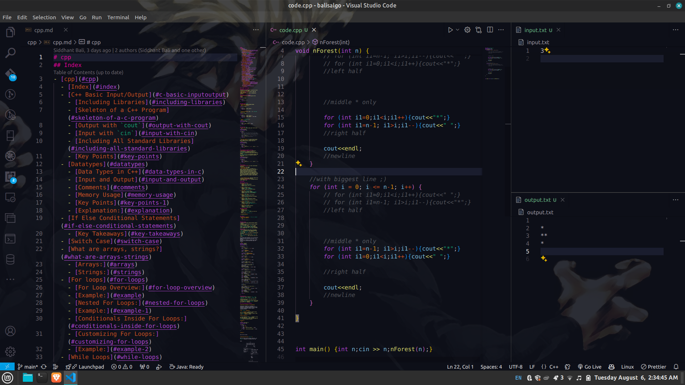
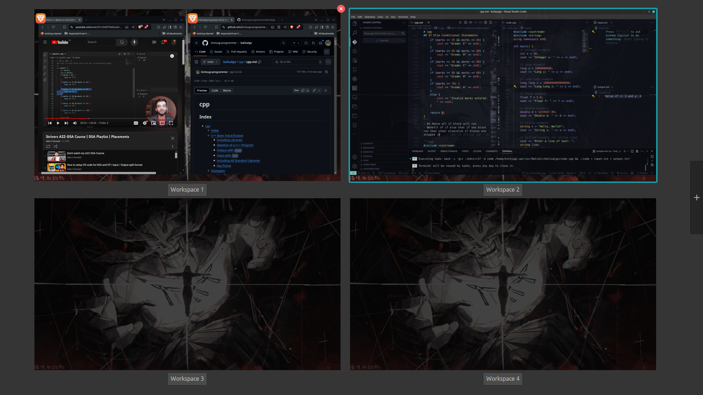

# balisalgo ;)
Ek Tuhi Nirankar

## Tips
- Don't Dive Deep
- Think and try brute force and when done and found new at solution ,take notes
- retry without video
- Do contests as much as possible even you know to solve 1 problem
- and no need to do 450 ques,just 300 are fine.also it has depth dsa which almost al l companies lack

## Code Setup

- create input.txt
- create output.txt
- create code.cpp
- .vscode/tasks.json
  ```json
    {
      "version": "2.0.0",
      "tasks": [
          {
              "label": "compile",
              "type": "shell",
              "command": "g++",
              "args": [
                  "-std=c++17",
                  "-o",
                  "${fileBasenameNoExtension}",
                  "${file}"
              ],
              "group": {
                  "kind": "build",
                  "isDefault": false
              }
          },
          {
              "label": "compile and run",
              "type": "shell",
              "command": "bash",
              "args": [
                  "-c",
                  "g++ -std=c++17 -o ${fileBasenameNoExtension} ${file} && ./${fileBasenameNoExtension} < input.txt > output.txt"
              ],
              "group": {
                  "kind": "build",
                  "isDefault": true
              }
          }
      ]
  }

  ```
  - Ctrl + Shift + B


Good Luck !!